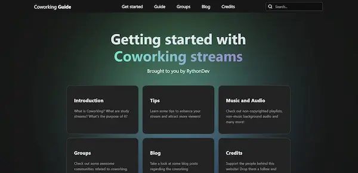

<div align="center">

# Coworking Guide

[](https://coworking-guide.vercel.app/)

<div style="display:flex; gap: 0 0.3em;justify-content:center;margin-top:1em;">


</div>

</div>

---

## Table of Contents

- [Coworking Guide](#coworking-guide)
  - [Table of Contents](#table-of-contents)
  - [Contributing](#contributing)
  - [Directives](#directives)
  - [Frontmatter](#frontmatter)
    - [Guide Content](#guide-content)
    - [Independent Pages](#independent-pages)
    - [Blog Post](#blog-post)

---

## Contributing

Guidelines: TBA

---

## Directives

```
:::warn
This is a warning!
:::

:::note
Note this down
:::

:::success
this was successful! 
::

:::danger
It could go very wrong
:::

:::tip
This is a cool tip!
:::
```

## Frontmatter

### Guide Content

```
---
title: 
layout: "../../layouts/GuideLayout.astro"
description: 
order: 0
---
```

- `title`: Page title
- `layout`: Path to layout file
- `description`: Description of the content
- `order`: The order in which it displays on the left bar

### Independent Pages

```
---
title: 
layout: "../../layouts/GuideLayout.astro"
description: 
---
```

- `title`: Page title
- `layout`: Path to layout file
- `description`: Description of the content

### Blog Post

```
---
heading: 
subheading: 
author: 
slug: spirit-city 
pubDate: 1970-01-01T0:00:00
---
```

- `heading`: the main title
- `subheading`: the tagline of the blog post
- `author`: name / username of author
- `slug`: desired URL slug
- `pubDate`: Published date (ISO 8601)

---